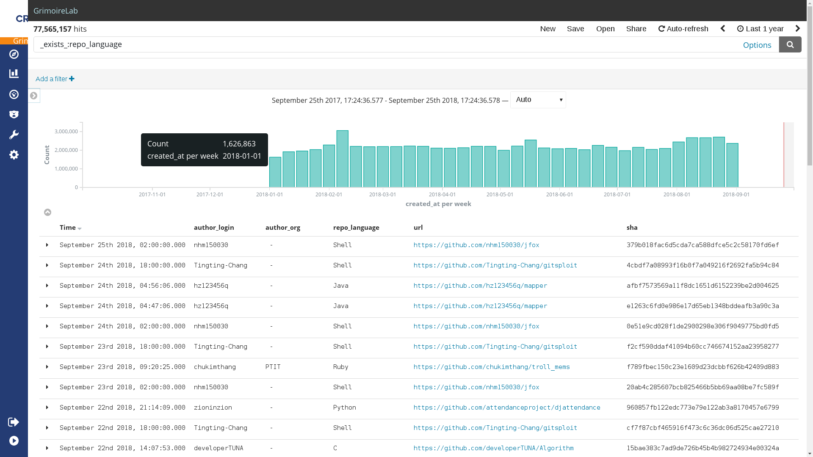
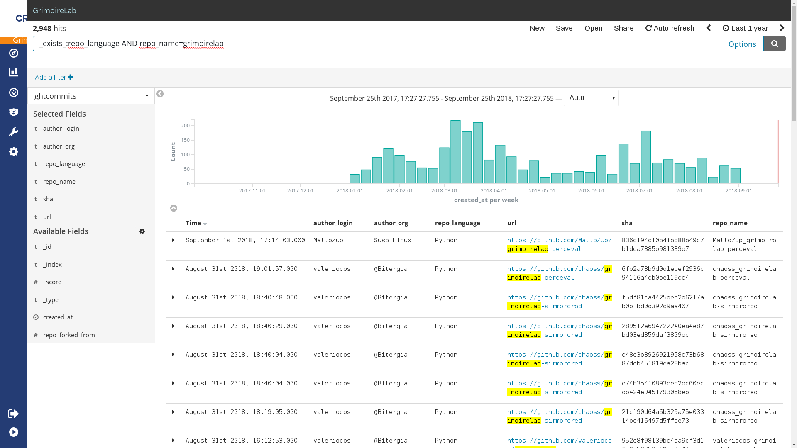

# ghtorrent

Experimental GitHub project analysis based on GHTorrent.

The goal of this project is to explore the use of GHTorrent to
understand better the life of Open Source software projects.

It is in the initial conception phase so probably only useful
to exchange ideas and early prototypes.

## Feedback

Don't hesitate to [open GitHub issues](https://github.com/acs/ghtorrent/issues) if you have any kind of problem or you
want to feedback or exchange thoughts.

## Requirements

It is needed a machine with 16GB of RAM, 4 cores and 1TB of hard disk to execute all without issues.

You need also a running Elasticsearch and Kibana.

And you will need around 12h of compute time (<1h human time) to execute all processes.

## Initial Step

The first step is to download [GHTorrent data](http://ghtorrent.org/downloads.html). The testing has been done with: 
[mysql-2018-09-01.tar.gz](http://ghtorrent-downloads.ewi.tudelft.nl/mysql/mysql-2018-09-01.tar.gz).

Now, there are two analysis. The first open loading the projects table
and the second one loading projects, users and commits.

## Projects (Repositories) analysis

To load the GitHub projects data in Elasticsearch:

* Import in MySQL the projects table using `ght-restore-mysql-projects`
* Import in Elasticsearch the projects data using `ght_projects2es.py`
```
ght_projects2es.py -e <elastic_url> -i ghtprojects --db-name ghtorrent_projects
```
* Use Kibana to visualize the projects data and start analyzing it

You will need around 4h to complete the above steps.

### Evolution in time of new projects


### Evolution in time of non fork new projects


### Evolution in time of new projects top 10 languages


The language detection is based on https://github.com/github/linguist

### Ranking with all languages 

[CSV data](all_languages.csv)

Compare with:

* [PYPL PopularitY of Programming Language](http://pypl.github.io/PYPL.html)
* [TIOBE Index](https://www.tiobe.com/tiobe-index//)
* [GitHub Octoverse](https://octoverse.github.com/)

## Commits

* Import in MySQL the commits, projects and users tables: it has been tested teh loading of commits only for 2018 (220MM).
For doing that:
```
grep '"2018-' commits.csv > commits-2018.csv
```
You must load this `commits-2018.csv` 22GB file instead of the commits.csv which is (100GB).

* Import in Elasticsearch the projects data using `ght_commits2es.py`
```
ght_commits2es.py -e <elastic_url> -i ghtcommits --db-name ghtorrent_commits
```
* Use Kibana to visualize the projects data and start analyzing it

You will need around 12h to complete the above steps.

### Evolution in time of commits for software projects



### Evolution in time of commits for Grimoirelab ecosystem

  